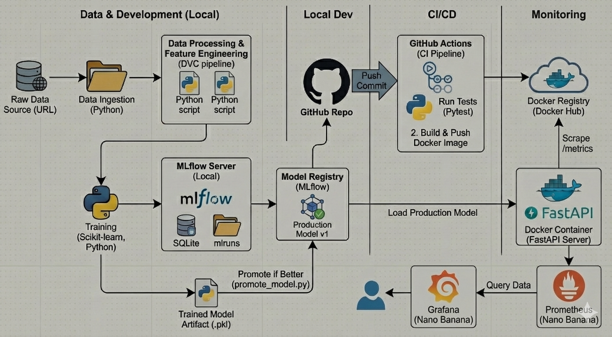

# 🚖 NYC Taxi ETA Prediction - MLOps 

A production-ready MLOps project that predicts the Estimated Time of Arrival (ETA) for NYC taxi trips. This repository demonstrates a complete End-to-End machine learning lifecycle, from data ingestion to model deployment, using industry-standard tools.

---

The project follows a modular MLOps architecture:

* **Data Pipeline:** Managed by **DVC** to track data versions and processing stages.
* **Experiment Tracking:** **MLflow** tracks parameters, metrics, and stores trained models.
* **Model Registry:** Production models are versioned and managed via MLflow's Model Registry.
* **Serving:** A **FastAPI** application serves predictions via a REST API.
* **Containerization:** The application is Dockerized for consistent deployment.
* **CI/CD:** **GitHub Actions** runs automated health checks and tests on every push.

---
## 🏗️ Architecture
Here is the high-level overview of the MLOps pipeline, including Data Ingestion, Model Training, and Deployment with Monitoring.

